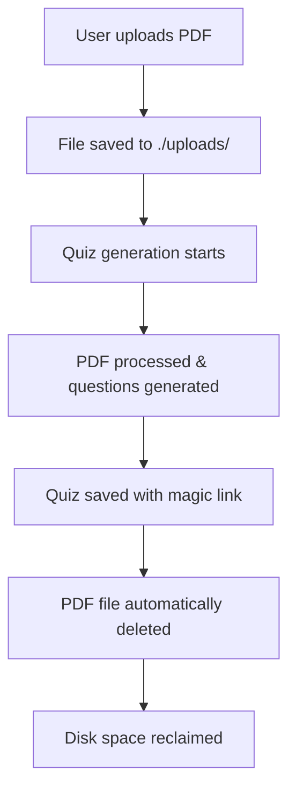
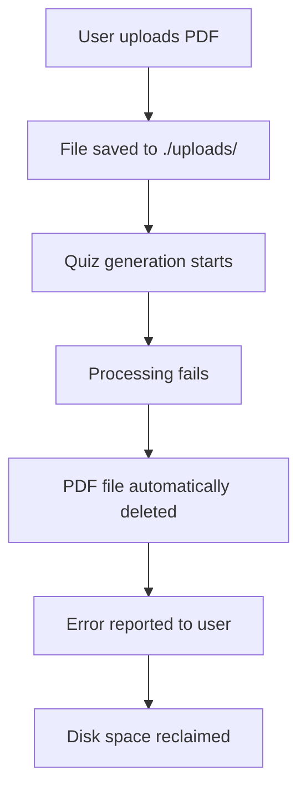

# Automatic File Cleanup System

## Overview
🧠 QuizAi automatically cleans up uploaded PDF files after quiz generation is complete, preventing disk space accumulation and maintaining optimal server performance.

## How It Works

### Automatic Cleanup Process
1. **File Upload**: User uploads PDF to `./uploads/` directory
2. **Quiz Generation**: System processes PDF and generates quiz questions
3. **Quiz Storage**: Complete quiz saved to `quiz-storage/` with magic link
4. **File Cleanup**: Original PDF file automatically deleted after successful generation
5. **Error Cleanup**: Failed uploads also cleaned up to prevent accumulation

### When Files Are Cleaned Up
- ✅ **Successful Generation**: PDF deleted after quiz is saved with magic link
- ✅ **Failed Generation**: PDF deleted after processing fails
- ✅ **Process Interruption**: Cleanup occurs even if generation is interrupted
- ⚠️ **Manual Disable**: Cleanup can be disabled for debugging purposes

## Configuration

### Environment Variable
Control cleanup behavior with the `CLEANUP_UPLOADED_FILES` environment variable:

```bash
# Enable automatic cleanup (default, recommended)
CLEANUP_UPLOADED_FILES=true

# Disable cleanup (for debugging only)
CLEANUP_UPLOADED_FILES=false
```

### Production Settings (Recommended)
```bash
# .env or docker-compose environment
CLEANUP_UPLOADED_FILES=true  # Keep servers clean
MAX_PDF_SIZE=104857600       # 100MB limit
MAX_PAGES_PER_PDF=200        # Page limit for processing
```

### Development Settings
```bash
# For debugging - keeps files for inspection
CLEANUP_UPLOADED_FILES=false
```

## File Lifecycle

### Normal Flow


### Error Flow


## Storage Structure

### Before Cleanup (Temporary State)
```
project/
├── uploads/
│   └── file-1704110400000-123456789.pdf  # Uploaded PDF (temporary)
├── quiz-storage/
│   └── temp_quiz_abc123.json              # Generating quiz
```

### After Cleanup (Final State)
```
project/
├── uploads/                               # Empty (cleaned up)
├── quiz-storage/
│   └── ABC123XYZ.json                     # Completed quiz with magic link
```

## Manual Cleanup

### API Endpoint
For manual cleanup of old files that may have accumulated:

```bash
# Clean up files older than 24 hours (default)
curl -X POST http://localhost:3001/cleanup-files

# Clean up files older than 6 hours
curl -X POST http://localhost:3001/cleanup-files \
  -H "Content-Type: application/json" \
  -d '{"olderThanHours": 6}'
```

**Response:**
```json
{
  "success": true,
  "message": "Cleanup completed: 5 files removed",
  "cleaned": 5,
  "errors": []
}
```

### Command Line Cleanup
For server maintenance:

```bash
# Remove all files older than 24 hours
find ./uploads -name "*.pdf" -mtime +1 -delete

# Remove all files older than 6 hours  
find ./uploads -name "*.pdf" -mmin +360 -delete

# Check current upload directory size
du -sh ./uploads/

# List files with timestamps
ls -la ./uploads/
```

## Monitoring & Maintenance

### Health Checks
```bash
# Check upload directory size (should be small/empty)
du -sh uploads/

# Count files in uploads (should be 0 or very low)
ls uploads/ | wc -l

# Check for old files (should be empty)
find uploads/ -mmin +60 -ls

# Monitor disk space
df -h .
```

### Log Monitoring
Look for these log messages:

```bash
# Successful cleanup
🗑️ Cleaned up uploaded PDF file: ./uploads/file-123.pdf

# Cleanup warnings (non-critical)
⚠️ Failed to clean up uploaded PDF file: File not found

# Debug mode (cleanup disabled)
📁 Keeping uploaded PDF file for debugging: ./uploads/file-123.pdf

# Manual cleanup results
🧹 Cleanup completed: 3 files removed, 0 errors
```

## Troubleshooting

### High Disk Usage
If the uploads directory is growing unexpectedly:

```bash
# Check if cleanup is enabled
grep CLEANUP_UPLOADED_FILES .env

# Check for stuck files
find uploads/ -mmin +60 -ls

# Manual cleanup
curl -X POST http://localhost:3001/cleanup-files

# Force cleanup all files
rm uploads/*
```

### Files Not Being Cleaned Up
**Possible causes:**
1. **Cleanup disabled**: Check `CLEANUP_UPLOADED_FILES=false`
2. **Permission issues**: Check file/directory permissions
3. **Process interruption**: Generation stopped before completion
4. **Disk full**: No space for temporary operations

**Solutions:**
```bash
# Check configuration
echo $CLEANUP_UPLOADED_FILES

# Check permissions
ls -la uploads/
chmod 755 uploads/
chmod 644 uploads/*

# Manual cleanup
curl -X POST http://localhost:3001/cleanup-files

# Check disk space
df -h .
```

### Error During Cleanup
**Symptoms:** Log messages like "Failed to clean up uploaded PDF file"

**Common causes:**
- File already deleted by another process
- Permission denied
- File being used by another process
- Disk I/O errors

**Response:** These are non-critical warnings that don't affect quiz generation success.

## Performance Impact

### Benefits
- **Disk Space**: Prevents unlimited growth of uploads directory
- **Server Performance**: Reduces file system overhead
- **Backup Efficiency**: Smaller backup sizes (only quiz data, not source PDFs)
- **Security**: Reduces exposure time of uploaded content

### Metrics
- **Average file size**: 1-10MB per PDF
- **Processing time**: 2-30 seconds per quiz
- **Cleanup time**: <1 second per file
- **Storage savings**: 100% of uploaded PDF size

## Best Practices

### Production Deployment
```bash
# Always enable cleanup in production
CLEANUP_UPLOADED_FILES=true

# Set reasonable file size limits
MAX_PDF_SIZE=104857600  # 100MB

# Monitor disk usage regularly
df -h . | grep -v tmpfs
```

### Development Environment
```bash
# Enable cleanup unless actively debugging
CLEANUP_UPLOADED_FILES=true

# For debugging specific issues, temporarily disable
CLEANUP_UPLOADED_FILES=false
```

### Disaster Recovery
- **Quiz data preservation**: Quizzes stored separately in `quiz-storage/`
- **Source PDFs**: Not needed after processing (by design)
- **Backup strategy**: Only backup `quiz-storage/` directory
- **Recovery**: Original PDFs not recoverable (intentional security feature)

## Security Considerations

### Privacy Benefits
- **Data minimization**: Source PDFs deleted after processing
- **Reduced exposure**: Temporary file existence minimized
- **GDPR compliance**: No unnecessary data retention
- **Storage security**: Only processed quiz data persists

### Access Control
- **File permissions**: Uploads directory should be write-only for app
- **Network access**: Uploads directory should not be web-accessible
- **Cleanup logs**: Don't log sensitive file content

## Integration Examples

### Docker Compose
```yaml
# docker-compose.yml
environment:
  - CLEANUP_UPLOADED_FILES=true
  - MAX_PDF_SIZE=104857600
volumes:
  - ./quiz-storage:/app/quiz-storage  # Persistent quiz storage
  # Note: uploads/ directory not mounted (ephemeral)
```

### Health Check Script
```bash
#!/bin/bash
# health-check.sh

UPLOAD_COUNT=$(ls uploads/ 2>/dev/null | wc -l)
UPLOAD_SIZE=$(du -s uploads/ 2>/dev/null | cut -f1)

if [ "$UPLOAD_COUNT" -gt 10 ]; then
    echo "WARNING: $UPLOAD_COUNT files in uploads directory"
    curl -X POST http://localhost:3001/cleanup-files
fi

if [ "$UPLOAD_SIZE" -gt 1000000 ]; then  # 1GB in KB
    echo "WARNING: uploads directory is ${UPLOAD_SIZE}KB"
    curl -X POST http://localhost:3001/cleanup-files
fi
```

### Monitoring Script
```bash
#!/bin/bash
# monitor-cleanup.sh

while true; do
    COUNT=$(ls uploads/ 2>/dev/null | wc -l)
    SIZE=$(du -sh uploads/ 2>/dev/null | cut -f1)
    echo "$(date): $COUNT files, $SIZE total"
    sleep 300  # Check every 5 minutes
done
```

This automatic cleanup system ensures optimal server performance while maintaining the core functionality of quiz generation and sharing through magic links. 