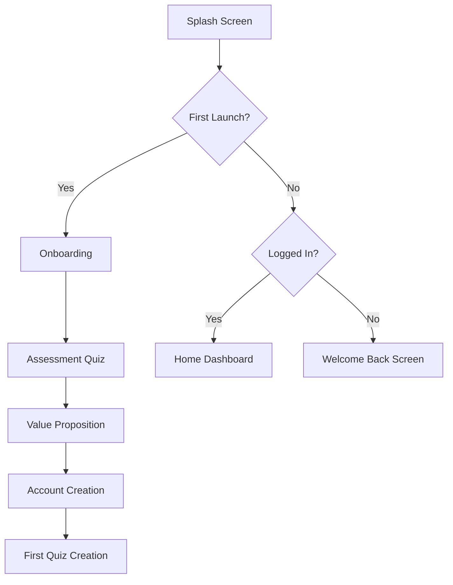

# User Flow & Onboarding - AiQuizMaker App

## 🚀 First-Time User Experience (FTUE)

### 1. **App Launch Flow**



### 2. **Onboarding Screens**

#### Screen 1: Welcome Animation
```typescript
{
  duration: 3000,
  elements: [
    { type: 'logo', animation: 'fadeIn' },
    { type: 'tagline', text: 'Van PDF naar Quiz in 30 seconden', animation: 'slideUp' },
    { type: 'cta', text: 'Start', animation: 'pulse' }
  ]
}
```

#### Screen 2-4: Value Props Carousel
```typescript
const valueProps = [
  {
    icon: '⚡',
    title: 'Bliksemssnel',
    description: 'AI genereert perfecte vragen in seconden',
    animation: 'lottie-lightning.json'
  },
  {
    icon: '📈',
    title: '15% Hogere Cijfers',
    description: 'Bewezen door 10.000+ studenten',
    socialProof: '4.8★ (2,500 reviews)'
  },
  {
    icon: '🏆',
    title: 'Verslavend Leuk',
    description: 'Verdien punten, unlock achievements, versla vrienden',
    preview: 'gamification-preview.mp4'
  }
];
```

### 3. **Personalization Assessment**

#### Interactive Quiz Format
```typescript
interface AssessmentFlow {
  questions: [
    {
      id: 'study_time',
      question: 'Hoeveel tijd besteed je per week aan studeren?',
      type: 'slider',
      range: [0, 40],
      unit: 'uur',
      insight: (value) => `Je kunt ${Math.floor(value * 0.3)} uur per week besparen!`
    },
    {
      id: 'difficulty',
      question: 'Wat vind je het moeilijkst?',
      type: 'card_select',
      options: [
        { icon: '🎯', label: 'Focus houden', value: 'focus' },
        { icon: '⏰', label: 'Time management', value: 'time' },
        { icon: '🧠', label: 'Onthouden', value: 'memory' },
        { icon: '😓', label: 'Motivatie', value: 'motivation' }
      ]
    },
    {
      id: 'goals',
      question: 'Wat is je doel dit semester?',
      type: 'multi_select',
      options: [
        'Hogere cijfers',
        'Minder stress',
        'Efficiënter studeren',
        'Meer vrije tijd'
      ]
    }
  ],
  
  resultScreen: {
    title: 'Jouw Persoonlijke Studieplan',
    insights: [
      '📊 Je kunt 6 uur per week besparen',
      '🎯 87% kans op hogere cijfers',
      '💰 Bespaar €2000 aan bijles'
    ],
    cta: 'Claim Je Gratis Quiz'
  }
}
```

### 4. **Account Creation Flow**

#### Frictionless Signup
```typescript
const signupFlow = {
  step1: {
    type: 'social_auth',
    options: ['Google', 'Apple', 'Email'],
    copy: 'Maak account in 5 seconden'
  },
  
  step2: {
    type: 'username',
    placeholder: 'Kies een gebruikersnaam',
    validation: 'realtime',
    suggestions: true
  },
  
  step3: {
    type: 'preferences',
    options: [
      'Push notificaties voor streaks',
      'Weekly progress emails',
      'Friend challenges'
    ],
    defaultEnabled: [0, 2] // Smart defaults
  }
};
```

## 📱 Core App Flows

### 1. **Home Dashboard**

```typescript
interface DashboardLayout {
  header: {
    greeting: 'Goedemorgen, {name}!',
    streak: { days: 7, animated: true },
    coins: { amount: 250, animation: 'countUp' }
  },
  
  sections: [
    {
      type: 'hero_action',
      title: 'Maak Nieuwe Quiz',
      subtitle: 'Van PDF naar quiz in 30 sec',
      action: 'upload_pdf'
    },
    {
      type: 'continue_learning',
      quizzes: recentQuizzes.slice(0, 3),
      showProgress: true
    },
    {
      type: 'daily_challenge',
      quiz: dailyQuiz,
      reward: { xp: 200, coins: 50 },
      timeLeft: '18:34:22'
    },
    {
      type: 'social_feed',
      items: friendActivity.slice(0, 5),
      action: 'view_all'
    }
  ]
}
```

### 2. **Quiz Creation Flow**

#### Step-by-Step Process
```typescript
const quizCreationSteps = {
  upload: {
    accepts: ['.pdf', '.docx', '.pptx'],
    maxSize: '50MB',
    preview: true,
    animation: 'drag-drop-bounce'
  },
  
  processing: {
    stages: [
      { text: 'PDF analyseren...', duration: 2000 },
      { text: 'AI vragen genereren...', duration: 3000 },
      { text: 'Quiz optimaliseren...', duration: 1000 }
    ],
    showTips: [
      'Wist je dat: 90% van studenten hogere cijfers haalt met quizzes?',
      'Pro tip: Speel je quiz direct na het maken voor beste resultaten'
    ]
  },
  
  customization: {
    options: [
      { type: 'title', editable: true },
      { type: 'difficulty', levels: ['Makkelijk', 'Medium', 'Moeilijk'] },
      { type: 'questionCount', range: [5, 50] },
      { type: 'language', options: supportedLanguages }
    ]
  },
  
  completion: {
    animation: 'confetti',
    actions: [
      { label: 'Speel Nu', primary: true },
      { label: 'Deel met Vrienden', icon: 'share' },
      { label: 'Naar Dashboard', icon: 'home' }
    ]
  }
};
```

### 3. **Quiz Playing Experience**

#### Immersive Quiz Interface
```typescript
interface QuizPlayFlow {
  entrance: {
    animation: 'slideUp',
    showMetadata: {
      questions: 20,
      estimatedTime: '10 min',
      highScore: '95%',
      playCount: 1234
    }
  },
  
  questionFlow: {
    layout: 'card-stack',
    transitions: 'swipe',
    feedback: {
      correct: { color: 'green', haptic: 'success', sound: 'ding.mp3' },
      incorrect: { color: 'red', haptic: 'error', sound: 'buzz.mp3' }
    },
    
    powerUps: {
      fiftyFifty: { cost: 25, coins: true },
      skipQuestion: { cost: 50, coins: true },
      extraTime: { cost: 30, coins: true }
    }
  },
  
  completion: {
    scoreReveal: 'animated-counter',
    rewards: {
      xp: calculateXP(score, time, streak),
      coins: calculateCoins(score),
      achievements: checkAchievements(performance)
    },
    
    shareCard: {
      template: 'instagram-story',
      elements: ['score', 'rank', 'streak', 'app-logo']
    }
  }
}
```

### 4. **Social Features Flow**

#### Friend System
```typescript
const socialFlows = {
  addFriends: {
    methods: [
      'contacts_import',
      'username_search',
      'qr_code',
      'share_link'
    ],
    
    onboarding: {
      title: 'Studeer Samen!',
      benefits: [
        'Daag vrienden uit',
        'Deel quizzes',
        'Vergelijk scores'
      ]
    }
  },
  
  challenges: {
    types: [
      { name: 'Quick Battle', duration: '5 min', live: true },
      { name: 'Daily Duel', duration: '24 hour', async: true },
      { name: 'Week Challenge', duration: '7 days', leaderboard: true }
    ],
    
    flow: [
      'select_friend',
      'choose_quiz',
      'set_stakes', // XP/Coins wager
      'send_challenge',
      'track_progress',
      'reveal_winner'
    ]
  }
};
```

## 🎯 Conversion Touchpoints

### 1. **Free to Paid Journey**

```typescript
const conversionPath = {
  freeQuizUsed: {
    trigger: 'after_first_quiz_creation',
    message: 'Je hebt je gratis quiz gebruikt! 🎉',
    delay: 0
  },
  
  softPaywall1: {
    trigger: 'attempt_second_quiz',
    message: 'Upgrade voor onbeperkt quizzes',
    dismissible: true,
    alternativeAction: 'play_others_quizzes'
  },
  
  valueReminder: {
    trigger: 'played_5_quizzes',
    message: 'Je hebt al 2 uur studiestijd bespaard!',
    showCalculation: true
  },
  
  hardPaywall: {
    trigger: 'attempt_create_after_soft_dismissal',
    message: 'Premium Unlock Nodig',
    benefits: highlightedBenefits,
    socialProof: recentUpgrades,
    offer: 'first_month_50_off'
  }
};
```

### 2. **Engagement Loops**

#### Daily Hook
```
6:00 - Morning motivation notification
8:00 - Check dashboard (streak reminder)
12:00 - Lunch break quiz suggestion  
16:00 - Friend challenge notification
20:00 - Evening study session
22:00 - Last chance streak warning
```

#### Weekly Pattern
```
Monday: New week, fresh goals
Wednesday: Mid-week boost needed
Friday: Weekend warrior prep
Sunday: Week review & planning
```

## 🔔 Smart Notification Flow

### Notification Decision Tree
```typescript
const notificationLogic = {
  shouldSend: (user) => {
    const factors = {
      lastActive: getHoursSinceActive(user),
      notificationFatigue: getRecentNotificationCount(user),
      engagementScore: calculateEngagement(user),
      localTime: getUserLocalTime(user)
    };
    
    return evaluateNotificationNeed(factors);
  },
  
  selectType: (user) => {
    const priorities = [
      { type: 'streak_risk', weight: 10 },
      { type: 'friend_challenge', weight: 8 },
      { type: 'achievement_close', weight: 6 },
      { type: 'daily_tip', weight: 3 }
    ];
    
    return weightedSelection(priorities, user);
  },
  
  personalizeCopy: (type, user) => {
    return copyVariations[type][user.personalityType];
  }
};
```

## 🎨 UI/UX Patterns

### Gesture Navigation
- Swipe right: Next question
- Swipe left: Previous question  
- Swipe up: Skip (if available)
- Swipe down: Show hints
- Long press: Power-up menu
- Pinch: Overview mode

### Micro-interactions
```typescript
const microInteractions = {
  buttonPress: 'scale(0.95) with spring',
  cardFlip: '3D rotate with shadow',
  scoreCount: 'rolling numbers with easing',
  achievementUnlock: 'burst animation with particles',
  streakFlame: 'flickering with glow',
  coinCollect: 'magnetic attraction to counter'
};
```

### Accessibility
- VoiceOver support
- Dynamic type scaling
- High contrast mode
- Reduced motion option
- Haptic feedback toggle
- Screen reader optimized